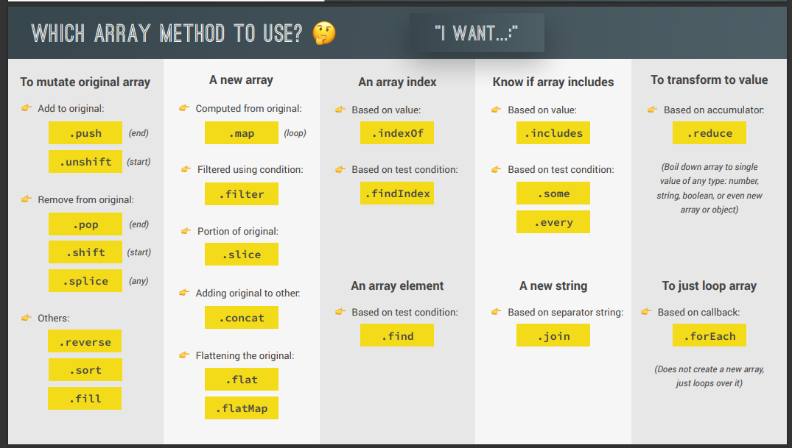
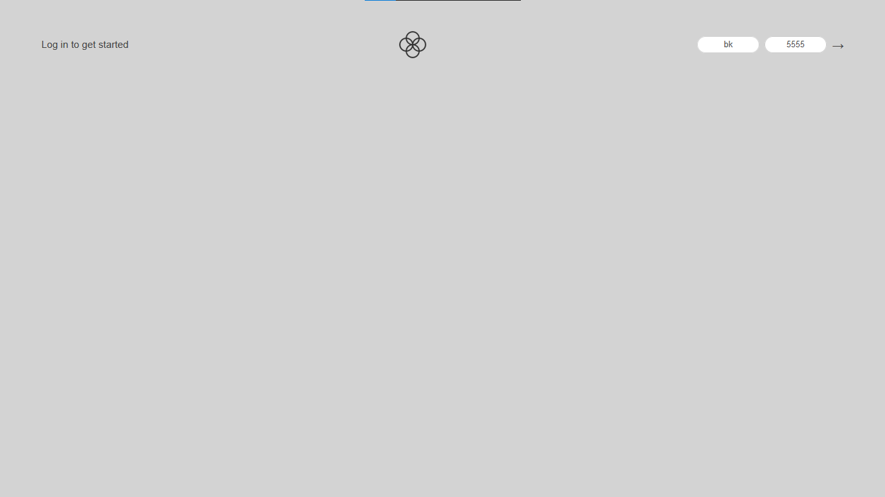
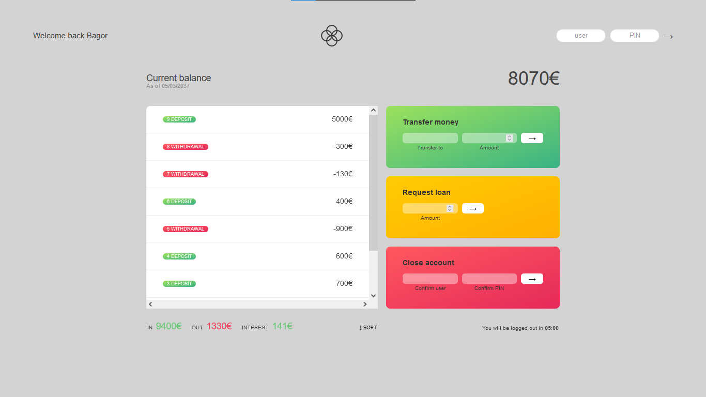

## Arrays in JavaScript

> In this section, we covered all about arrays and many array methods

### Some of the methods covered and when to use them ?

    

## Bankist

> In order to learn and apply all the array methods, we built this beatifull project called Bankist.

### Flowchart for the project

    

### How it works ?

> 1st you should login in by inserting a username and pin

    for example you can login by using 'bk' as a username and '5555' as a PIN

    

> As you login, it displays the home page where you can do many things

_for example_

- Your current balance

- You transactions

  - deposits

  - withdrawals

  - Your interest

- You can transfer money

  - it accepts the username and amount of money you want to transfer

- You can Request money

- and You can also close your account

    

_all right, This is it!!!_
