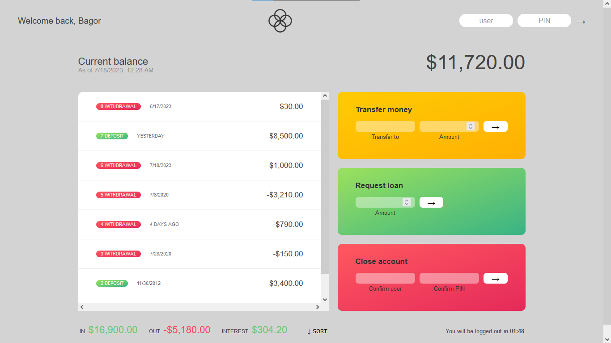

## Numebers, Dates and Timers

> In this section, we will focus on Numbers and Dates. 

> and also We will continue working on the Bankist App and we will incorporate Numbers, Dates, Internationalization and Timers

### Bankist App

#### Modifications
 
> As you know in this section we learn about Dates, Numbers, Internationalization, and Times. So we applied these on our Bankist App
   * Starting from the previous app, we added : 
       * Dates for each movements
       * formating Numbers
       * Adding count down timer to track inactivity of the user

    

