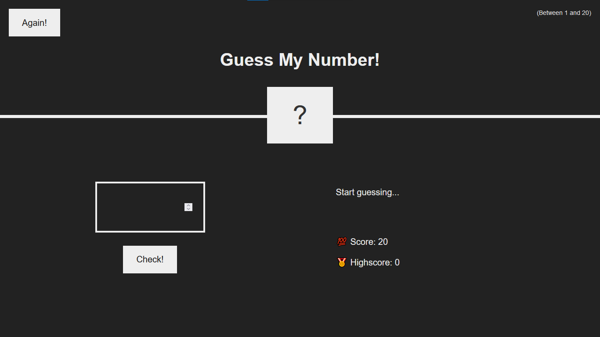
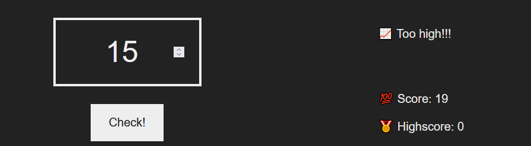
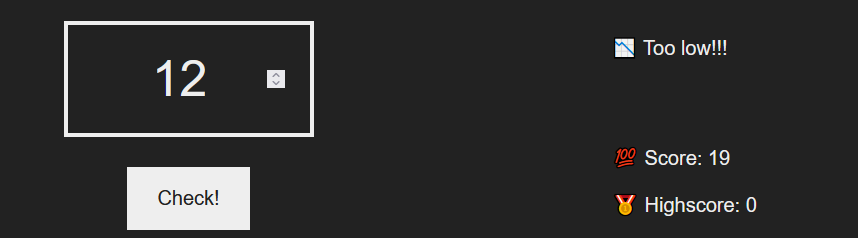
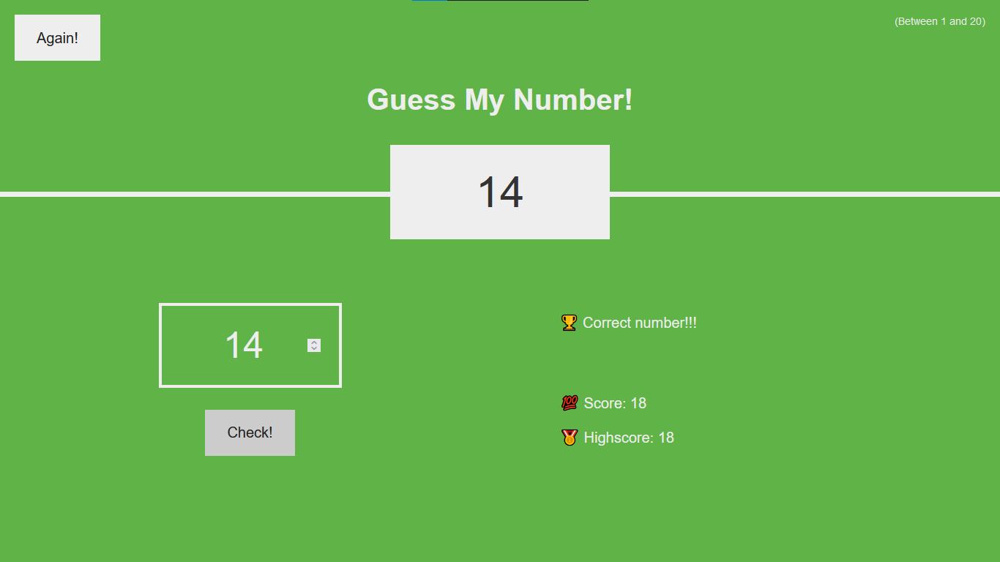

# WHAT NUMBER AM I THINKING? GUESS IT... 

## About this Simple Project

> It Basically designed to understand the Basics of DOM Manipulation. ` not more than ` _I'm kidding_! 

## Installations

> There is no need to install anything 😃. Just Run it!

## Little about the Game
>  It has an Input where you enter Your guess (between 1 and 20) and then click the ` Check ` button
   every time you Guess wrong, It gives you a hint whether You predict to high or to low. but _your score decrease by one😪_.
   when You get the correct number, your Highscore will be saved, the Secret number displayed and the background color changes

### Before you Guess, What it looks like?

    

### when You guess to High

    

### when You guess to Low

    

### When You guess the correct : 

    

