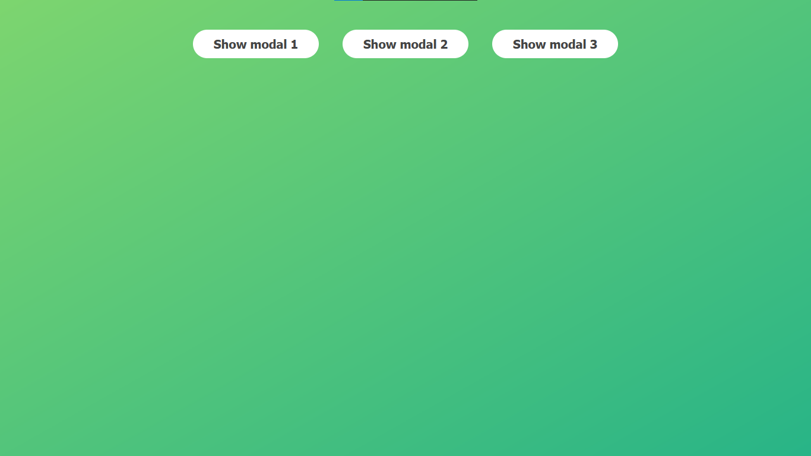
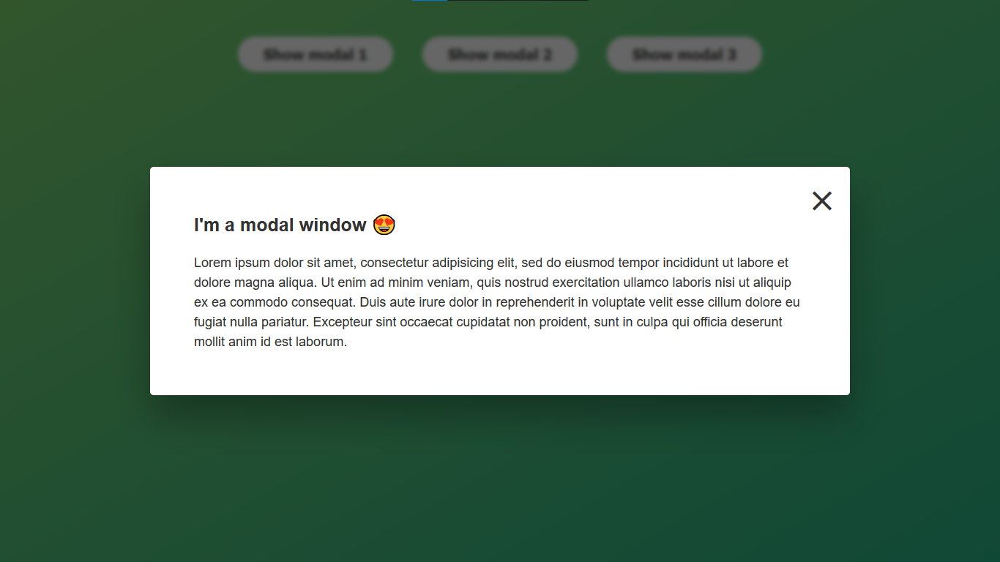

## Simple Popup box - Modal Window

> In this project we gonna build, the first UI component.

### About The project

  we can see the modal window by clicking one the buttons

  We can close it by clicking 

     - The close button on the modal window

     - Outside of the modal window 

     - The Escape key on the keyboar

### What it looks like?

  

> when You click one of the buttons, it shows the modal window like this.

  

> I think it's good to know how to handle keyboard events in javascript 
